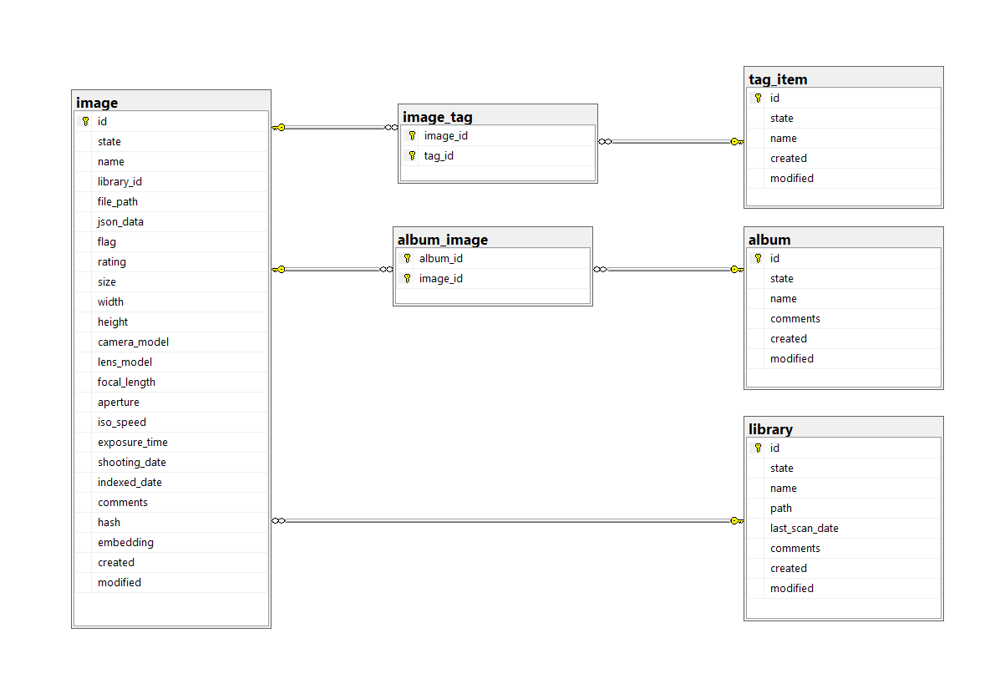

# Context scaffolding for Microsoft SQL Server

Scaffold-DbContext "Server=localhost;Database=PhotoDb;Trusted_Connection=True;TrustServerCertificate=True" Microsoft.EntityFrameworkCore.SqlServer -OutputDir Models -NoPluralize -StartupProject PhotoDb.Data.Test -NoOnConfiguring -Force

